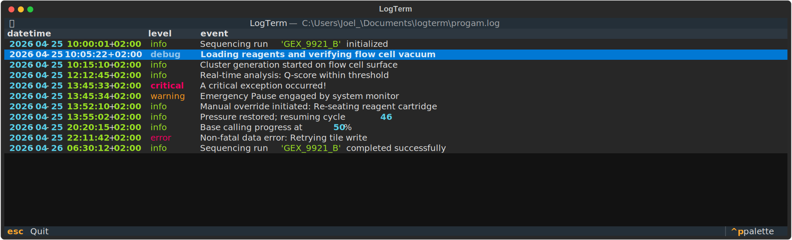

[](https://github.com/fburleson/logterm/actions/workflows/repo_quality.yaml)
# logterm

A library and CLI tool for analysing log files 🧐



## Installation

### Requirements

- Python 3.13+

### Install

#### uv

##### As CLI tool
```bash
uv tool install git+https://github.com/fburleson/logterm.git
```

##### As project dependency
```bash
uv add git+https://github.com/fburleson/logterm.git
```

#### pip
```bash
pip install git+https://github.com/fburleson/logterm.git
```

## Usage

#### CLI
```bash
uvx logterm 20260403.log
```

#### Python

Run logterm on a separate thread in Python.

```python
import threading
from pathlib import Path

from logterm.app.main import run

def main():
    logterm_process = threading.Thread(target=run, args=(Path("20260403.log"),))
    logterm_process.start()


if __name__ == "__main__":
    main()
```
